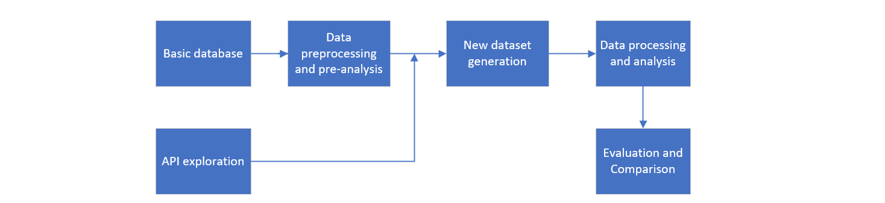

# Readme

## Project Who's the Better Navigator? A Race Through Wikipedia City: Humans vs GPT

### Data Story: https://epfl-ada.github.io/ada-2024-project-genshinstart/
### Introduction

**Abstract:**

The project aims to explore and compare the strategies of humans and GPT in the Wikispeedia game. The goal of the game is to find the shortest paths between two Wikipedia articles. We investigated the difference of human navigation paths and GPT navigation paths and there strategy. Besides, by comparing with optimal paths, we tried to improve the prompt for better performance through extracting the features of better paths, and through prompt optimization by applying textgrad.

**Motivation:**

With the rapid development of LLMs, its application scenarios have become more extensive, whether it can migrate to the search problem is an interesting topic. In the Wikispeedia game, finding the possible shortest paths in a graph under the implicit semantic information between nodes could be an example to this problem.

**Research Question:**

What are the differences between AI, human and optimal paths and strategies? 
Could we improve the prompt to get better results?

### Implement: 

**Pipeline**:

The research process follows this workflow:

**Database:**

We used wikispeedia that has been provided and based on this, we extracted the human navigation paths in the dataset. Besides, we generated paths for 159 most frequent (start article, destination) pairs in human navigation paths using GPT 4o-mini, which can be downloaded from https://drive.google.com/file/d/19cHamrMGMWwMOOKIl_zdv7Opp29B_gbG/view?usp=drive_link, to see more details related to these generated paths, please visit our website.
This file contains
- paths: The paths generated using baseline prompt.
- paths_improved_prompt: The paths generated using manually improved prompt.
- paths_before_tuning: The paths generated under modified task.
- paths_after_tuning: The paths generated using prompt tuned by GPT-4o.
- paths_after_tuning_4o_mini: The paths generated using prompt tuned by GPT-4o mini.

**Method/Metrics**

0. Preprocessing and Pre-analysis: Perform initial data cleaning and initial data visualization.
1. After balancing cost and performance, we choose to apply gpt 4o-mini to generate the navigation path made by LLM. Then in the experiment, we will try different prompts, to analysis its impact on the output, like whether there is bias (such as introducing prior knowledge, etc.), and finally choose one to generate the AI navigation paths dataset, with the same distribution of <origin, destination> pairs as human navigation paths dataset. 
2. Graph construction: the articles and the links between them can be naturally structured as digraphs.
3. To measure the difference between the navigation paths made by human and LLM, we could focus on: (i) The statistic of the path, such as the average path length, the most frequently accessed node and its feature, the difference between decisions made by human and LLM like the title level distribution and the title position distribution. (ii) The metrics to measure how closer each move made to the destination, such as the distance change to the destination, or the embedding change which is detailed in 4.
4. If we map each node in the graph into a vector, then we can get a measure of the distance between two nodes, which can be on the graph scale and semantic scale. (i) Graph embedding: by applying Node2Vec, this embedding contains the structural information related to graph. (ii) Semantic embedding: by applying SentenceTransformer, we could turn each node(title) into vector, which contains the semantic information to the document. Once the embedding is got, the distance between two nodes can be implemented as Euclidean distance or cosine similarity, then the efficiency or semantic interpretability for each move can be measured.

**Tool**

Python

OpenAI:Chatgpt 4o-mini

**Timeline**

| Date                 | Content                             |
| :------------------- | ----------------------------------- |
| Now - Nov.15th       | Data preprocessing and pre-analysis |
| Nov.16 - Nov.24th    | LLM dataset generation              |
| Nov.25th -  Dec.8th  | Processing and analysis             |
| Dec.9th - Dec.15th   | Evaluation, comparison and report   |
| Dec.16th - Dec.20th  | Final Check and Supplement          |

### Conclusion

This project compares the abilities of humans and GPT to find paths in Wikipeedia games, aiming to understand the differences in strategy, efficiency, and semantic understanding. 

